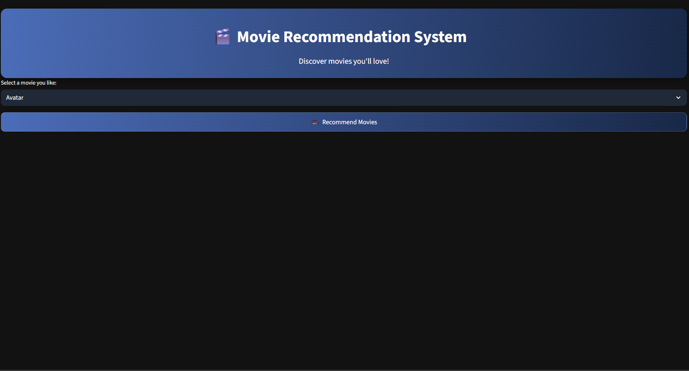
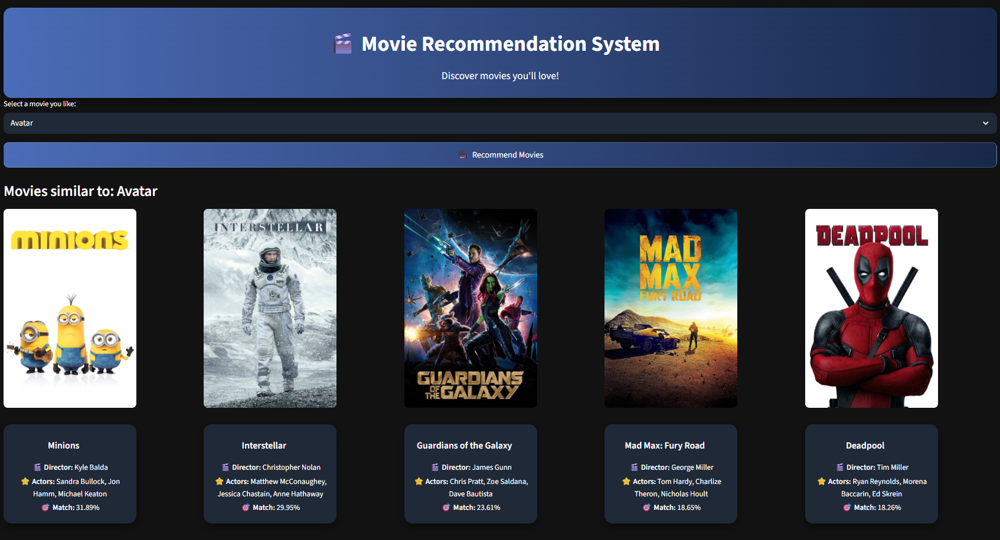

# 🎬 Movie Recommendation System (Content + Popularity Based)


This repository contains a **Streamlit-based Movie Recommendation
System** built using the **TMDB 5000 dataset**. The system recommends
movies based on textual similarity (overview, genres, keywords, cast,
director) combined with a popularity-based weighting.

------------------------------------------------------------------------

## 🚀 Project Overview

The system follows these main steps:

1.  **Data Preprocessing (Colab/Jupyter)**
    -   Load `tmdb_5000_movies.csv` and `tmdb_5000_credits.csv`
    -   Extract important features:
        -   movie_id
        -   title
        -   overview
        -   genres
        -   keywords
        -   cast (top 3 actors)
        -   director
        -   popularity
    -   Clean and transform text data
    -   Create a unified `tags` column
    -   Apply stemming using PorterStemmer
    -   Convert text to vectors using **TF-IDF**
    -   Compute cosine similarity matrix
2.  **Hybrid Recommendation Logic**
    -   Final score = **70% content similarity + 30% normalized
        popularity**
    -   Top 5 movies are recommended for a selected title
3.  **Streamlit Web App**
    -   Dropdown to select a movie
    -   Button to generate recommendations
    -   Movie posters fetched from TMDB API
    -   Each recommendation shown inside a professional card with:
        -   Movie title
        -   Poster
        -   Director
        -   Top 3 actors
        -   Match percentage

------------------------------------------------------------------------

## 📸 Screenshots


### 1️⃣ Home Screen (Movie Selector)


### 2️⃣ Recommendation Results (Cards View)


### 3️⃣ Individual Movie Card (Poster + Details)


------------------------------------------------------------------------

## 📁 Files in this Repository

    app.py                 # Streamlit application
    movies_dict_v3.pkl     # Preprocessed movie dataset
    requirements.txt       # Required Python packages
    README.md              # Project documentation

> ⚠️ **Important:**\
> The similarity matrix file (`similarity_v3.pkl`) is **NOT included in
> this repository** because it exceeds GitHub's 25MB limit.

You can download it from Google Drive here: https://drive.google.com/drive/folders/1EuoXNh1zXH6t8MDHCjkhlrsMrwACXbHI?usp=sharing

👉 **DOWNLOAD SIMILARITY FILE:**\
PASTE_YOUR_GOOGLE_DRIVE_LINK_HERE

After downloading, place it in the same folder as `app.py`.

------------------------------------------------------------------------

## 🛠️ How to Run Locally

### Step 1 --- Clone the repo

``` bash
git clone <your-repo-link>
cd <repo-folder>
```

### Step 2 --- Install dependencies

``` bash
pip install -r requirements.txt
```

### Step 3 --- Download similarity file

Download from the Drive link above and place it inside the project
folder.

### Step 4 --- Run Streamlit app

``` bash
streamlit run app.py
```

Open the link shown in your terminal (usually `http://localhost:8501`).

------------------------------------------------------------------------

## 🧠 Model Details

-   Text vectorization: **TF-IDF (5000 features)**
-   Similarity metric: **Cosine Similarity**
-   Hybrid scoring:
    -   70% content match
    -   30% popularity boost

This helps popular movies appear slightly higher in recommendations.

------------------------------------------------------------------------

## 🎯 Future Improvements

-   User ratings integration
-   Personalized recommendations
-   Genre filters
-   Year-based sorting
-   Real-time search
-   Cloud deployment

------------------------------------------------------------------------

## 👨‍💻 Author

**Shahrier Sabit**\
B.Sc. in Computer Science & Engineering\
Independent University, Bangladesh\

------------------------------------------------------------------------

